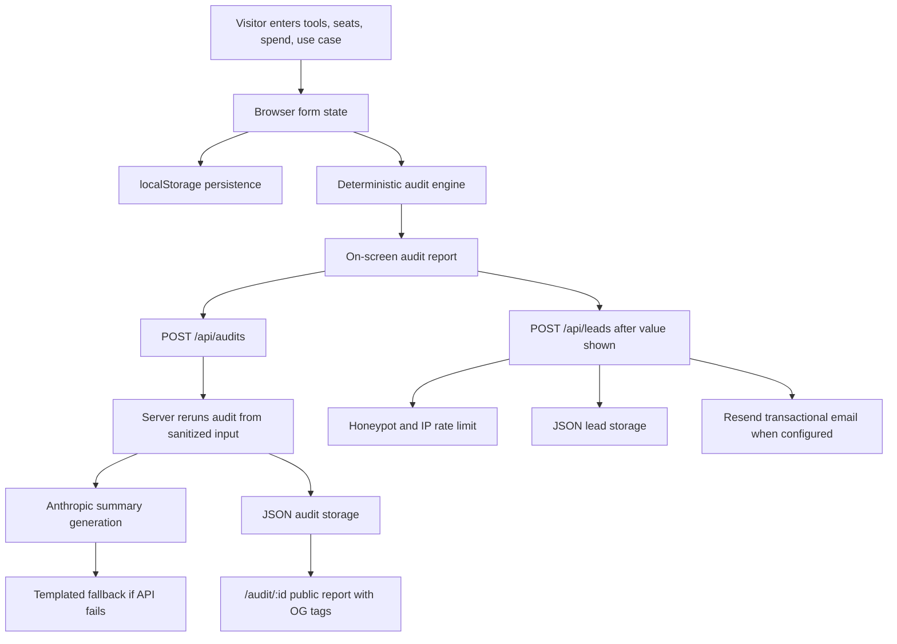

# Architecture

## Data Flow

The user enters team size, primary use case, and one row per paid AI tool. The browser persists the form in `localStorage` on every edit, so reloads do not wipe the audit. The same deterministic audit engine runs in the browser for instant feedback and on the server before storing a shareable result, so a user cannot manipulate totals by editing the DOM.

The server stores audit records separately from lead records. Public audit pages include tools, plans, seats, savings, and reasoning, but not email, company, or role. Lead capture uses a honeypot field and a simple per-IP in-memory rate limit. Resend is integrated behind `RESEND_API_KEY`; without that key, the lead still stores and the app degrades gracefully.

Bonus features reuse the same audit record. Benchmark mode is computed inside the deterministic audit engine so it is available in browser, server, and public reports. Referral codes are created when an audit is stored and can be passed back into future lead submissions. PDF export uses the browser print pipeline with print-specific CSS, which avoids server-side PDF dependencies while still producing a full report. The embeddable widget is a standalone script under `/public/widget.js` so a blog can load it with one `<script>` tag.

## Stack Choice

The assignment allows React, Next.js, Vue, Svelte, SolidJS, or vanilla. I chose vanilla JavaScript plus a small Node HTTP server because the local environment did not expose a package manager. That choice lowered dependency risk and produced a fast app with no client bundle step. If this were a team project, I would likely move to Next.js with TypeScript, server actions, and a typed database adapter once package installation and deployment infrastructure were available.

## 10k Audits Per Day

At 10k audits/day I would replace JSON file storage with Postgres or Supabase, add a durable queue for LLM summaries and transactional emails, and put audit creation behind a stricter distributed rate limiter such as Upstash Redis. I would also version the pricing data and rules so reports remain reproducible after vendor price changes. Public audit pages should be cached at the CDN edge because they are immutable after creation.
