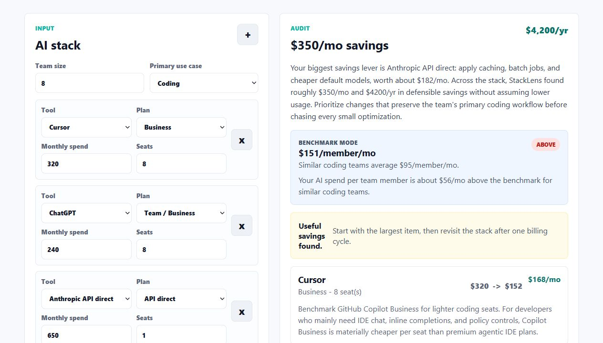
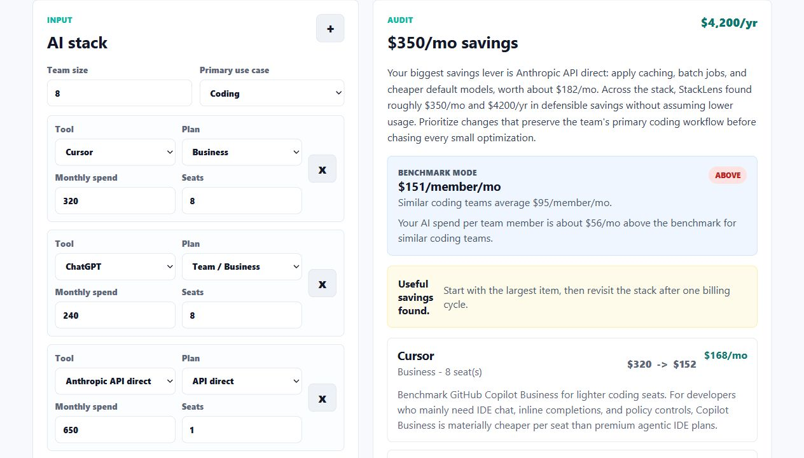
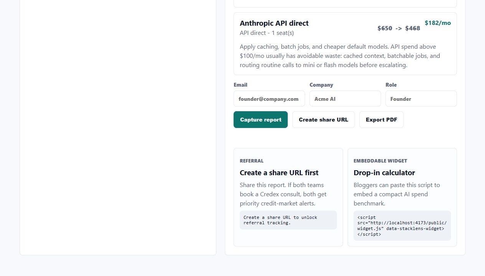

# StackLens

StackLens is a free AI spend audit app for startup founders and engineering managers who pay for tools like Cursor, Copilot, Claude, ChatGPT, Gemini, Windsurf, and direct model APIs. It shows an instant per-tool savings report, captures leads after value is delivered, and creates public share URLs with identifying details stripped out.

**Live deployed URL:** TODO: deploy this repo and replace with the production URL.

## Screenshots





## Quick Start

```bash
npm install
npm run dev
```

Open `http://localhost:4173`. To deploy, use a Node host such as Render, Fly.io, Railway, or a Vercel serverful deployment with `npm start` and `PORT` supplied by the platform.

Optional environment variables:

```bash
ANTHROPIC_API_KEY=sk-ant-...
ANTHROPIC_MODEL=claude-sonnet-4-6
RESEND_API_KEY=re_...
EMAIL_FROM="StackLens <audit@yourdomain.com>"
```

## Decisions

1. I used vanilla HTML, CSS, and JavaScript instead of a framework because this machine did not expose `npm`, `pnpm`, or `yarn`, and the assignment permits vanilla. The trade-off is fewer components and no TypeScript compiler, but the app remains fast, inspectable, and deployable with only Node.
2. The audit math is deterministic rules, not LLM output. That makes the savings explainable and testable, while the LLM is reserved for the personalized narrative summary as requested.
3. Lead capture happens after the audit is visible. This keeps the product useful even when the user does not convert.
4. Public audit URLs store only the sanitized input and audit result. Email, company name, and role are kept in the lead record and never rendered on the public page.
5. The backend stores JSON files by default so the app works locally and in simple Node deployments. For production, I would swap the storage adapter to Supabase or Postgres without changing the audit engine.

## Verification

```bash
npm run lint
npm test
```

The test suite covers the audit engine: same-vendor downgrade, no fake savings, list-price reconciliation, API optimization, high-savings Credex routing, input sanitization, and fallback summaries.

## Bonus Features

- PDF export through a print-ready report view. Use **Export PDF** and save as PDF in the browser print dialog.
- Embeddable widget at `/public/widget.js`:

```html
<script src="https://your-domain.com/public/widget.js" data-stacklens-widget></script>
```

Local widget demo: `http://localhost:4173/public/widget-demo.html`.

- Benchmark mode compares AI spend per team member against a use-case peer estimate.
- Referral codes are generated for every saved audit and included in referral share URLs.
- Launch copy is drafted in `LAUNCH_DRAFT.md`.
